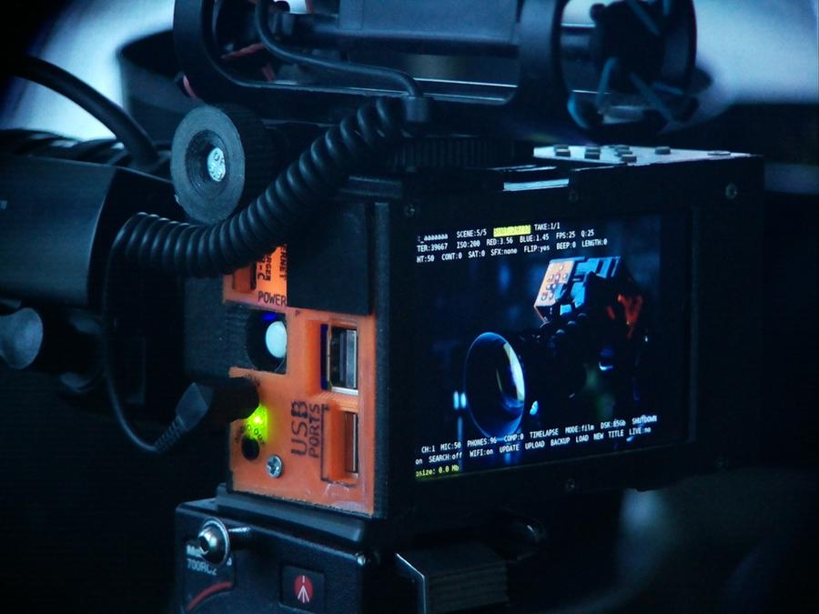

Gonzo Pi software goto [https://github.com/rbckman/gonzopi](https://github.com/rbckman/gonzopi)
Gonzo Pi build instruction see complete [Gonzo Pi Manual](https://github.com/rbckman/gonzopi_build/blob/master/gonzopi-manual.md#building-repairing-and-modding)

The Gonzo Pi Philosophy: Filmmaking, Unchained
--------------------------------
The Gonzo Pi isn’t just a camera—it’s a palm-sized, Raspberry Pi-powered beast built for storytellers who want to dive headfirst into their world and come out with a film that’s as real as it gets. It’s not about perfection; it’s about truth, immediacy, and creativity unleashed.

The Tree of Creation: Every Take Matters
-----------------------------------------
At the heart of Gonzo Pi is it's unique approach organizing your work: the film/scene/shot tree directory structure. Think of it as a blueprint for your scenes and films. Simple yet so powerful that your camera becomes your studio. Every film you start is a new root folder. Within it, scenes and shots branch out as subfolders, and each shot holds your raw takes with eventual cut and effect pointers. Every edited take becomes a new take and every removed take is in a specifik folder named yourfilm_onthefloor. Removing takes from this specifik folder is like sweeping the floor and your takes are permanently removed.

Freedom Through Open Source
----------------------------
The Gonzo Pi is open-source because creativity shouldn’t be locked behind proprietary walls. Its 3D-printed body, Raspberry Pi core, and customizable software invite you to hack, mod, and make it your own. Want to mount it on a drone? Make it waterproof? Add a bizarre lens from a 1970s thrift shop? Go for it. The Gonzo Pi is a canvas for your imagination, not a walled garden.

Who’s This For?
---------------
You. The dreamer, the tinkerer, the storyteller who doesn’t need a Hollywood budget to make something real. Whether you’re a coder rigging multi-camera setups or a newbie just pointing and shooting, the Gonzo Pi meets you where you are. It’s for anyone who believes a story is worth telling, no matter how raw or unpolished.

In the spirit of gonzo, the Gonzo Pi dares you to grab it, run into the chaos, and come back with a film that’s unmistakably yours. 

Technical Section: Getting Started with the Gonzo Pi
----------------------------------------------------
Now that you’re pumped about the Gonzo Pi’s vibe, let’s get it up and running. This section covers the basics of setting up your hardware, installing the software, and understanding the film/scene/shot/take tree that makes the Gonzo Pi so intuitive. No tech degree required—just a bit of curiosity and a love for filmmaking.

Hardware Setup
--------------
The Gonzo Pi is a compact, customizable filmmaking machine. Here’s what you’ll need to build one:

- Raspberry Pi 4B: The brain of the operation. (A 3B+ or 3B works too, but 4B is the standard.)
- Sony IMX Camera Sensor (12.3MP): Captures crisp, vibrant footage.
- C-Mount and CS-Mount Lenses: Pick a lens for your style—vintage, wide-angle, or quirky. C-mount adapters are widely available.
- 3D-Printed Body: Download the STL files from gonzopi.org and print the case. It’s designed for easy assembly and modding.
- MicroSD Card and an External USB3 SSD Hard-Drive: SD card is for the brainz and the External Hard-Drive is for storing your films.
- Power Source: 7800mAh li-ion Battery pack (5-6h of filming)
- Optional Add-Ons: HDMI display for a bigger view, USB sound card for better audio, or a viewfinder for precision.

So how does it work in detail?
-----------------------------
Let's start with how to control it.

Control the GonzoPi with a keyboard or through the network or with physical buttons; Enter, Up, Down, Left, Right, Record, Retake, View and Remove.

Keys
====

### Keyboard

With keys up and down you change a specific setting, for example shutter speed. With keys left and right you change what settings to change. With view, you can view the last shot or if you have a specific scene highlighted the camera would automatically glue all shots together and play that scene for you, same goes for film. With remove you can remove a specific take, shot, scene or film. With the retake button you retake a bad take, this is how the camera keeps track of your good takes. The last take is always the chosen one.

Special keys on the keyboard (CAPITAL):

H = Hide / Show Help

C = Copy scene/shot

M = Move (as in cut and paste) scene/shot

I = Insert empty, copied or cut scene/shot

S = Screen On / Off

Spacebar / PageUp = Rec / Stop

PageDown = Retake

Tab = View

A = Hide / Show Menu

\break

How to make a film from many takes?
------------------------------------

It's very simple and intuitive. Press view button while a scene is selected will glue all last takes of all shots in that scene together and play it. Press view while a film is selected will glue all scenes in that film together.

And multitrack audio dubbing
----------------------------
Pressing enter/middle button on a film, scene or shot will take you to a multitrack dub settings menu. Here you can press record to begin a new audio dub track, you can have as many dub tracks as you need. Next time you view your shot, scene or film it will be mixed in.

Retake
-------
After recording, press record to make next shot or press retake and you'll be filming a new take, the last take in a shot is chosen when viewing a scene or the whole film.
Hint! pressing record while browsing existing takes, shots and scenes will take you to the last shot in that scene. Pressing retake will do just that, a retake. Makes perfectly sense, right? Fiddle around with it, you'll totally get it.

\break

Menus
=====
A short explanation of all the settings and why they are where they are.

### Film, scene, shot and take
The idea of the workflow is: film only the essential, you can merge your shots of a scene and view it on the spot and do a retake if you need to fix something rather than filming a bunch and fixing it later while editing. When you get the hang of it there won't be not much editing later.

### Dubbing
If you press enter while you've highlighted the film name or a scene you'll be entering dub settings menu. (ADD:d:1.0/o:1.0) this indicates the volume of the (d)ub to the previous (o)riginal mix. So, for example if you want the dub volume to be 50% of the previous audio, the settings would look like this (ADD:d:0.5/o:1.0). A good all-around background music volume level is only 10% so it would look like this (ADD:d:0.1/o:1.0). The other setting is fade in and out in seconds (in: 0.5) (out: 1.0) whould be half a second in and a second out. Now if you press enter while the ADD is highlighted you'll be dubbing. You can change the settings later if you come back to the menu.

### Shutter, iso, red, blue
Shutter and iso are well know basic camera concepts. With red and blue you control the colors. If you press enter while on any of these then it will go into auto mode and if you press it again it will go back to manual mode with the current auto settings. I'm using this feature to quickly find a reasonable good value before I'm locking and tuning the settings manually to my likings. Cuz you always will know better than the robots!

### Bright, cont, sat
Color grade on the go with brightness, contrast and saturation. You will probably have to play with theses to figure out what you want. Remember that as you're making your film ready while you're shooting it take by take, there's no color grading later on so you'll have to settle on your color grade before you film. To get that good old spaghetti western look go with the contrast at -19.

### VFX
Some realtime effects like invert, negative, film grain, solarize, denoise, colorpoint, solorswap, posterize and blur

### Flip, beep, lenght
If you go gonzo, flippin it is the way to go! beep is a countdown timer from the moment you press rec or retake to when it actually starts filming. Lenght let's you put in the lenght of your take before you actually start filming. Both of these are very useful if you film action alone and can't reach for the buttons. 

### Mic, phones, comp
Control teh level of your mic and headphones. Comp is a basic compressor so your message comes across and we hear ya! it's quite harsh at the moment but I like it when it goes craking up abit like in the good old 70s cinema.

### Timelapse
(this is not picture timelapse this is video timelapse, working on picture timelapse) Press middle button on TIMELAPSE and you'll be in timelapse menu here you can choose the intervall of the takes, now this isn't really a traditional timelapse, it will instead do a 0.2 sec video at each intervall or it can be set to your likings but 0.2 is good for a traditional timelapse effect. At the bottom of the screen is a calculation of how long the clip will be if you do the timelapse for an hour. I'd say don't over do it! a 10 - 20 sec clip is already quite a stretch but its up to you, you're the movie film director.

### Dsk, shutdown, srv, wifi
Disk space, showing you how much of space left on your sd card. Shutdown, when your really done! it's good to do this before cutting the power or otherwise there's a small chance of sd card corruption. Srv is a network server, if your connected to a network and put this on you should be able to go to any browser on any device and watch your movie films (that is if you've rendered them first), just go to the ip address of your gonzopi (move around the cursor to get updated ip, you'll find it when you've connected it. Press enter on wifi. There it is on the bottom of the screen, looks like this 192.168.1.105). If you press enter on wifi you will be transported to a glorious program called Wicd curses, here you really need to have a keyboard to set up your connections. Hints are down on the screen what buttons to press. To get back into Gonzopi press "q".

### Update and upload
Update the camera to the most exclusive version, this is still pretty much a-work-in-progress and as a warnign expect some bugs! don't worry I'll be improving things but it takes time. Upload your film to the web, there is a youtube uploader mod you can install but you'll have to do some configs to make it work for you. Details coming soon. Reach out to the matrix room if you're in a hurry..

to get the youtube api secrets `wget https://gonzopi.org/yt/.client_secrets.json`

### Load and new
You can have many on going films, load em up or start as many films as you like.

### Multi-camera
Press middle button on SRV: to view multicamera options

### Blending
Copy a take and choose what take to blend with and hit middle button on BLEND:

### Live
Hit enter to select where to push stream (what ip and port) it will then be saved til you remove it with remove button

### MUX
When MUX 'yes' mp3 is merged together with the video, it will take a little longer to render but this is essentially what you want to do when you have your film ready and want to share it.

------------------------------
